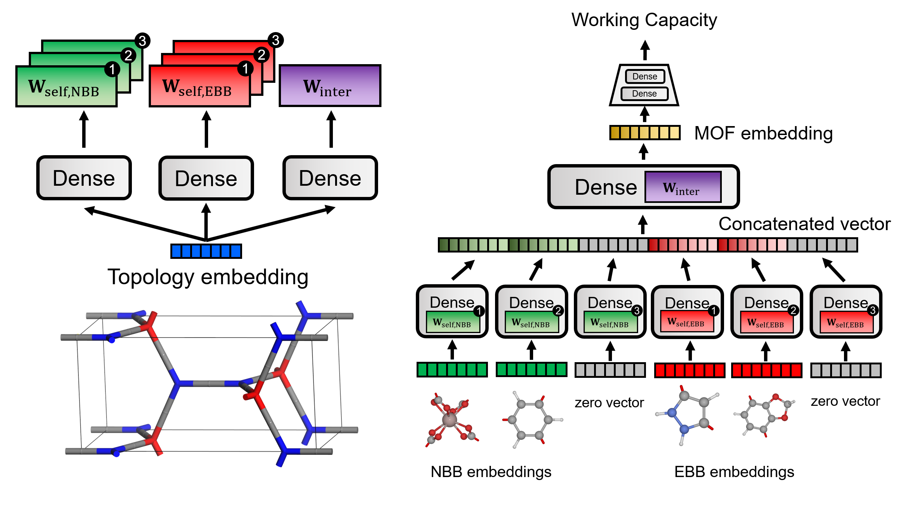

# MOF-NET

`Tensorflow 2.x` implementation of [MOF-NET](https://pubs.acs.org/doi/10.1021/acsami.1c02471).
Deep neural network for the prediction of MOF properties from topology and building blocks.



## Installation

In current folder, type following command:

```bash
$ pip install -e .
```

## Usage

Please check `train_mofnet.ipynb` in `examples` folder.